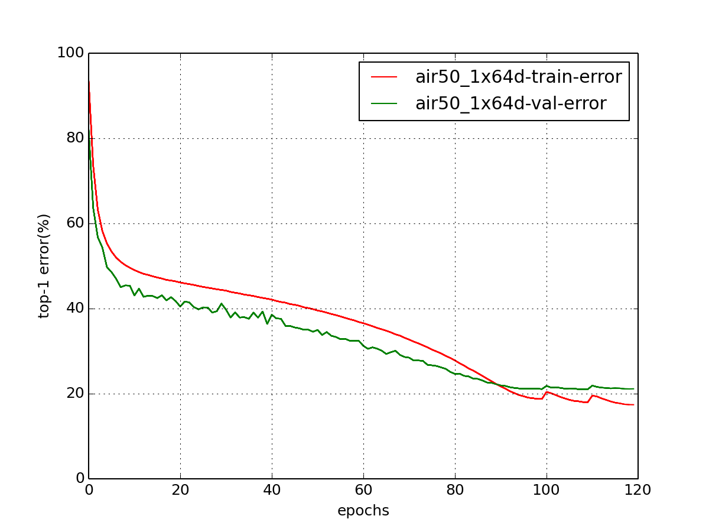

# pytorch-priv
Pytorch implementation for Classification, Semantic Segmentation, Pose Estimation and Object Detection
- [x] **Image Classification**
- [ ] **Semantic Segmentation** (progressing...)
- [ ] **Object Detection** (progressing...)
- [ ] **Pose Estimation** (progressing...)

## Install
* Install [PyTorch>=0.3.0](http://pytorch.org/)
* Clone recursively
  ```
  git clone --recursive https://github.com/soeaver/pytorch-priv
  ```
* pip install easydict


## Training and Evaluating
**For training:**
1. Modify the `.yml` file in `./cfg/cls/air50-1x64d`:
   * the `ckpt` is used to save the checkpoints
   * if you want use cosine learning rate, please set `cosine_lr: True`, the `lr_schedule` and `gamma` will not be used
   * for resuming training, add the `model.pth.tar` to `resume: ` and modify `start_epoch`
2. Train a network:
     ```
     python train_cls.py --cfg ./cfg/cls/air101-1x64d/air50_1x64d_imagenet.yml 
     ```

**For evaluating:**
1. Modify the `.yml` file in `./cfg/cls/air50-1x64d`:
   * add the `model.pth.tar` to `pretrained: `
   * set the `evaluate: True`
2. Evaluate a network:
     ```
     python train_cls.py --cfg ./cfg/cls/air101-1x64d/air50_1x64d_imagenet.yml 
     ```


## Features
- [x] [Aligned Inception ResNet (AIR)](https://arxiv.org/abs/1703.06211)
- [x] [Cosine Learning Rate](https://arxiv.org/pdf/1707.06990.pdf) 
- [x] [Mixup](https://arxiv.org/pdf/1710.09412.pdf) (progressing...)


## Results

### ImageNet
Single-crop (224x224) validation error rate is reported. 

| Model                       | Flops (M) | Params (M) | Top-1 Error (%) | Top-5 Error (%)  |
| :-------------------------: | --------- |----------- | --------------- | ---------------- |
| AIR50-1x64d                 | 6148.2    | 35.9       | 21.14           | 5.57            |

<div align='center'>
  
</div> 


## Contribute
Feel free to create a pull request if you find any bugs or you want to contribute (e.g., more datasets and more network structures).
